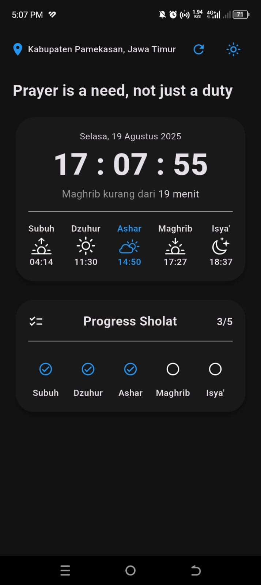
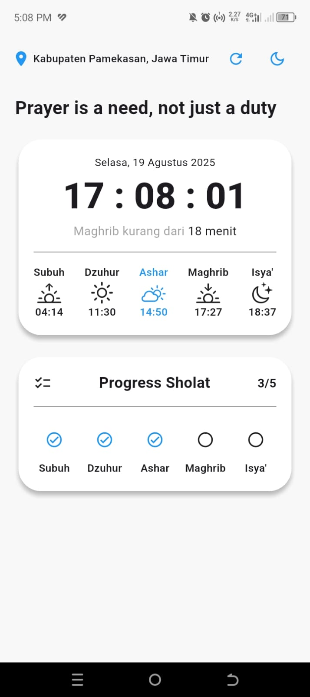

# 🕌 Sholat Reminder App

A Flutter mobile application that helps Muslims to stay consistent with their daily prayers.  
The app provides **accurate prayer times** based on GPS location, **reminders via notifications**, and a **prayer checklist** to track daily performance.  
State management is implemented using **BLoC** for better scalability and maintainability.  

---

## ✨ Features

- 📍 **GPS-based prayer times** (automatic location detection).  
- 🔔 **Smart notifications** for each prayer time, even when the app is closed.  
- 📝 **Prayer checklist** to track your daily prayers.  
- 🌙☀️ **Dark & Light theme support** with smooth toggle.  
- 🧩 **BLoC State Management** for clean architecture.  

---

## 📸 Screenshots

<p align="center">
  
  
</p>

---

## 🛠️ Tech Stack

- [Flutter](https://flutter.dev/) (Dart)  
- [flutter_local_notifications](https://pub.dev/packages/flutter_local_notifications) – prayer reminders  
- [workmanager](https://pub.dev/packages/workmanager) – background task scheduling  
- [bloc](https://pub.dev/packages/flutter_bloc) – state management  

---

## 🚀 Getting Started

### 1. Clone the repository
```bash
git clone https://github.com/username/sholat_reminder.git
cd sholat_reminder
```

### 2. Install dependencies
```bash
flutter pub get
```

### 3. Run the app
``` bash
flutter run
```
